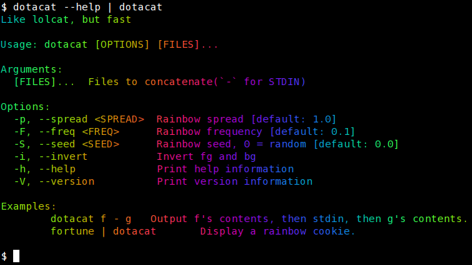

# dotacat-fast

A high-performance fork of [`dotacat`](https://gitlab.scd31.com/stephen/dotacat) — a colorful `cat` clone, similar to `lolcat`, but faster.

This fork rewrites core internals to be even faster, simpler, and leaner — great for use in your shell of choice and scripts where latency matters.



---

## 🚀 Why This Fork?

The original `dotacat` was already faster than `lolcat`, but still included:
- A runtime regex engine (`regex`)
- Lazy statics (`lazy_static`)
- Heap-alloc-heavy formatting via the `colored` crate

This fork removes all of those, replacing them with:
- A zero-allocation, hand-written ANSI escape parser
- Direct ANSI color emission via `write!`
- `BufWriter`-based stdout to reduce system calls

---

## ⚡ Performance

On a trivial input like `echo hi | dotacat`:

| Tool                       | Typical Runtime  |
|----------------------------|------------------|
| `lolcat`                   | ~420 ms          |
| `dotacat` (original)       | ~400 µs          |
| `dotacat-fast` (this fork) | **~70 µs**       |

No output changes, just pure speed.

---

## 📦 Installation

### With Cargo

```bash
cargo install --git https://github.com/YOURNAME/dotacat
```

### With Nix Flakes

If you're using flakes, you can include:

```bash
{
  inputs.dotacat.url = "github:YOURNAME/dotacat";

  outputs = { dotacat, ... }: {
    packages.x86_64-linux.default = dotacat.packages.x86_64-linux.default;
  };
}
```

Then add dotacat to your system packages.

### 📚 Usage

```bash
USAGE:
    dotacat [FLAGS] [OPTIONS] [files]...

ARGS:
    <files>...    Files to concatenate (`-` for STDIN)

FLAGS:
    -h, --help       Prints help information
    -i, --invert     Invert fg and bg
    -V, --version    Prints version information

OPTIONS:
    -F, --freq <freq>        Rainbow frequency [default: 0.1]
    -S, --seed <seed>        Rainbow seed, 0 = random [default: 0.0]
    -p, --spread <spread>    Rainbow spread [default: 1.0]
```

### Examples

```bash
dotacat f - g     # Output f's contents, then stdin, then g's contents
fortune | dotacat # Display a rainbow cookie
```

### 🔖 License and Credit

MIT Licensed. Original author: [Stephen D](https://gitlab.scd31.com/stephen)

This fork is maintained independently and aims to be a drop-in, faster alternative.
